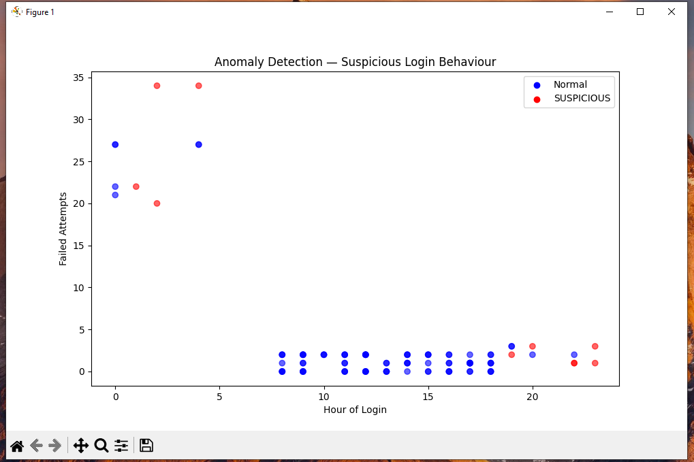
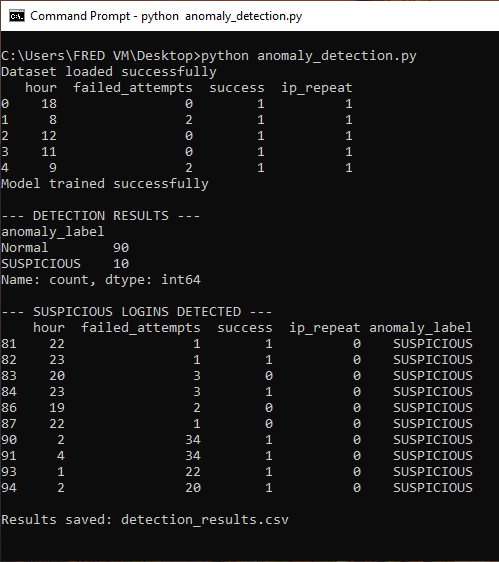

# 🤖 Anomaly Detection for Suspicious Login Behaviour
## Using Isolation Forest Algorithm in Machine Learning

---

## 📌 Problem
Traditional rule-based detection requires knowing 
what an attack looks like in advance. This project 
uses Machine Learning to detect suspicious login 
behaviour automatically by learning what normal 
looks like, without being explicitly told what 
an attack is.

---

## 🎯 Objectives
- Generate a realistic login behaviour dataset
- Train an Isolation Forest model on normal behaviour
- Automatically flag anomalous login activity
- Visualize results to identify attack patterns

---

## 🛠️ Tools Used
| Tool | Purpose |
|---|---|
| **Python** | Core programming language |
| **Pandas** | Data organization and manipulation |
| **Scikit-learn** | Isolation Forest ML algorithm |
| **Matplotlib** | Data visualization and charting |

---

## 📊 Dataset
Synthetic login dataset with 100 records across 
three behaviour categories:

| Category | Count | Characteristics |
|---|---|---|
| Normal | 80 | Business hours (8-18), 0-2 failures, known IP |
| Suspicious | 10 | After hours (19-23), 1-4 failures, mixed IP |
| Attack | 10 | Off hours (0-4), 20-35 failures, unknown IP |

**Features used:**
- `hour` — Hour of login attempt
- `failed_attempts` — Number of failed logins
- `success` — Whether login was successful
- `ip_repeat` — Whether IP has been seen before

---

## 🤖 Model — Isolation Forest

Isolation Forest detects anomalies by isolating 
data points that are different from the majority. This means that the algorithm finds outliers by isolating unusual data points.

Key principle:
- Normal data points are hard to isolate because 
  they blend in with similar points
- Anomalies are easy to isolate because 
  they stand out from the rest

**Model Parameters:**
- `contamination=0.1` — expects ~10% anomalies
- `random_state=42` — ensures consistent results
- Features: hour, failed_attempts, success, ip_repeat

---

## 📸 Results

### Detection Summary
| Label | Count |
|---|---|
| ✅ Normal | 90 |
| 🚨 Suspicious | 10 |

### Anomaly Detection Chart

### Command Prompt Results

---

## 🧠 Analysis

### What the Model Detected
The Isolation Forest model successfully flagged 10 
suspicious login records including:

**Clear Brute Force Attacks:**
- Hour: 0-4 (off hours)
- Failed attempts: 20-35
- Unknown IP addresses
- Eventually successful login

**After Hours Suspicious Activity:**
- Hour: 19-23
- Unknown IP addresses
- Multiple failed attempts

### Why Some Normal Dots Appear High
The model uses multivariate analysis, this means that it considers 
all 4 features together, not just failed attempts.
A login with high failures but a known IP during 
business hours may still be classified as normal 
because multiple factors are weighed together.

This reflects real world complexity because anomaly 
detection is never binary, and a human analyst 
always reviews flagged items to make the final 
decision.

---

## ⚠️ Limitations
| Limitation | Explanation |
|---|---|
| **False Positives** | Normal behaviour occasionally flagged as suspicious |
| **False Negatives** | Some attacks may not be flagged |
| **Synthetic Data** | Real world logs would require model retraining |
| **Human Review** | ML can only flags candidates while analysts make final decisions |

---

## ✅ Conclusion
The Isolation Forest model successfully detected 
suspicious login behaviour without being explicitly 
told what an attack looks like. It learned normal 
patterns and automatically flagged deviations.

In a real SOC environment this model would:
- Run continuously against live authentication logs
- Flag suspicious logins for analyst review
- Complement rule based SIEM detection like Splunk
- Reduce analyst workload by filtering noise

---

## 🔗 Related Projects
- [Brute Force Detection Using Splunk](https://github.com/phredreeq/brute-force-detection)
- [Incident Investigation Report](https://github.com/phredreeq/incident-investigation-report)

---

## 👤 Author
Fredrick Agufenwa
Cybersecurity Student | SOC & Threat Detection
