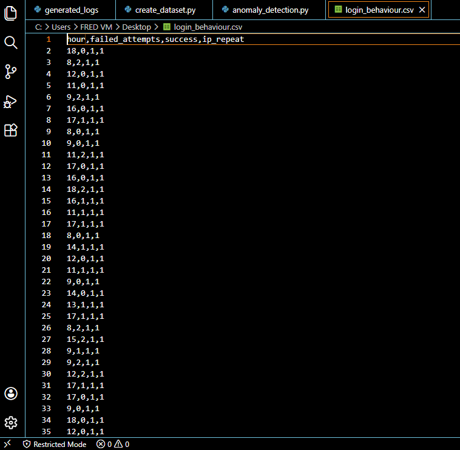

# 🤖 Anomaly Detection for Suspicious Login Behaviour
### Using Machine Learning to Detect Attacks Without Rules

---

## 🎯 What This Project Is About

Traditional rule-based detection like Splunk requires
you to know what an attack looks like in advance.

This project uses a different approach — Machine
Learning. Instead of defining attack rules, we teach
a model what NORMAL looks like. The model then
automatically flags anything that doesn't fit.

This is called anomaly detection and it is one of
the most powerful techniques in modern SOC work.

Attack type: Suspicious Authentication Behaviour
Detection method: Isolation Forest — Unsupervised ML
Tools: Python, Pandas, Scikit-learn, Matplotlib

---

## 🧠 Understanding the Detection Approach

### Rule-Based Detection vs Machine Learning

Rule-based detection — Splunk approach:
You write: if failures > 5 then flag it
Problem: attacker just tries 4 times and avoids detection

Machine learning detection — this project:
You show the model 100 normal logins
Model learns what normal looks like
Model automatically flags anything unusual
Problem: attacker cannot simply avoid a rule
they do not know exists

### What is Isolation Forest?

Isolation Forest detects anomalies by trying to
isolate individual data points from the dataset.

Normal data points are hard to isolate:
They are surrounded by similar data points
Many splits needed to separate them

Anomalous data points are easy to isolate:
They stand out from the rest
Few splits needed to separate them

The easier a point is to isolate — the more
suspicious it is flagged by the model.

Think of it like a crowd:
Finding a normal person in a crowd is hard
Finding someone in a bright red clown suit is easy
Isolation Forest finds the clown suit.

### The Four Features Used for Detection

The model evaluates four features simultaneously
for every login record:

| Feature | What it measures | Why it matters |
|---|---|---|
| hour | Time of login (0-23) | Off-hours activity is suspicious |
| failed_attempts | Number of failed logins | High failures indicate attack |
| success | Whether login succeeded | Success after failures = breach |
| ip_repeat | Whether IP is known | Unknown IP = higher risk |

### Why Four Features Together?

This is called multivariate analysis — the model
considers all four features at the same time not
just one.

Example:
A login at 2AM with 30 failures from unknown IP
= very suspicious — multiple features abnormal

A login at 2AM from known IP with 0 failures
= possibly legitimate — only one feature abnormal

This is why some normal dots appear high on the
chart — high failures alone does not confirm an
attack if other features look normal.

---

## 🎯 MITRE ATT&CK Mapping

| Field | Details |
|---|---|
| Tactic | Credential Access (TA0006) |
| Technique | Brute Force (T1110) |
| Sub-technique | Password Guessing (T1110.001) |
| Detection approach | Anomaly based — behavioural |
| Reference | attack.mitre.org/techniques/T1110 |

### What This Means

Unlike rule-based detection which targets specific
known patterns, this ML approach detects behavioural
anomalies — any login behaviour that deviates
significantly from the established normal baseline.

This means it can detect new attack variations that
rule-based systems would miss entirely.

---

## 🛠️ Prerequisites

### Operating System
Windows 10 or later (tested on Windows 10 VM)

### Required Tools
| Tool | Version | Purpose |
|---|---|---|
| Python | 3.14+ | Core programming language |
| Pandas | Latest | Data organization and CSV handling |
| Scikit-learn | Latest | Isolation Forest ML algorithm |
| Matplotlib | Latest | Scatter plot visualization |

### Install Required Libraries
Open Command Prompt and run:
pip install pandas
pip install scikit-learn
pip install matplotlib

### Required Knowledge
- Basic understanding of what machine learning is
- No prior Python or ML experience needed
- All code and explanations provided

---

## 🏗️ Architecture

### How It Works
1. Python generates synthetic login dataset with
   three behaviour categories
2. Isolation Forest model trains on the full dataset
3. Model scores every record and flags anomalies
4. Matplotlib visualizes results as scatter plot
5. Results saved to CSV for further analysis

---

## 📁 Project Files

| File | Purpose |
|---|---|
| create_dataset.py | Generates synthetic login dataset |
| anomaly_detection.py | Trains ML model and detects anomalies |
| login_behaviour.csv | Generated dataset (created by script) |
| detection_results.csv | Results with anomaly labels |
| anomaly_detection_chart.png | Scatter plot visualization |
| screenshots/ | Evidence of detection results |

---

## 🔬 Step by Step — How to Replicate

### Step 1 — Install Python and Libraries

Download Python from python.org/downloads
During installation check: Add Python to PATH

Verify Python installation:
python --version
Expected output: Python 3.14.x

Install required libraries:
pip install pandas
pip install scikit-learn
pip install matplotlib

Verify installations:
pip show pandas scikit-learn matplotlib
Expected: version numbers displayed for each

---

### Step 2 — Create the Dataset Generator

Create a file called create_dataset.py
and paste this code:

import pandas as pd
import random

random.seed(42)
data = []

for i in range(80):
    data.append({
        "hour": random.randint(8, 18),
        "failed_attempts": random.randint(0, 2),
        "success": 1,
        "ip_repeat": 1
    })

for i in range(10):
    data.append({
        "hour": random.randint(19, 23),
        "failed_attempts": random.randint(1, 4),
        "success": random.choice([0, 1]),
        "ip_repeat": random.choice([0, 1])
    })

for i in range(10):
    data.append({
        "hour": random.randint(0, 4),
        "failed_attempts": random.randint(20, 35),
        "success": 1,
        "ip_repeat": 0
    })

df = pd.DataFrame(data)
df.to_csv("login_behaviour.csv", index=False)
print("Dataset created: login_behaviour.csv")

### What this script creates:

| Category | Count | Characteristics |
|---|---|---|
| Normal logins | 80 | Business hours, 0-2 failures, known IP |
| Suspicious logins | 10 | After hours, 1-4 failures, mixed IP |
| Attack logins | 10 | Off-hours, 20-35 failures, unknown IP |

Why three categories?
Real world logs are never black and white.
Including slightly suspicious data teaches the
model that not everything unusual is an attack.
This reduces false positives.

---

### Step 3 — Run the Dataset Generator

Open Command Prompt and navigate to your file:
cd Desktop

Run the script:
python create_dataset.py

Expected output:
Dataset created: login_behaviour.csv

Open the CSV and verify:
- 100 rows of data
- 4 columns: hour, failed_attempts, success, ip_repeat
- Last 10 rows show hours 0-4 with high failures

---

### Step 4 — Create the Detection Model

Create a file called anomaly_detection.py
and paste this code:

import pandas as pd
from sklearn.ensemble import IsolationForest
import matplotlib.pyplot as plt

df = pd.read_csv("login_behaviour.csv")
print("Dataset loaded successfully")
print(df.head())

features = ["hour", "failed_attempts", "success", "ip_repeat"]
X = df[features]

model = IsolationForest(contamination=0.1, random_state=42)
model.fit(X)
print("Model trained successfully")

df["anomaly_score"] = model.decision_function(X)
df["anomaly"] = model.predict(X)

df["anomaly_label"] = df["anomaly"].apply(
    lambda x: "SUSPICIOUS" if x == -1 else "Normal"
)

print("\n--- DETECTION RESULTS ---")
print(df["anomaly_label"].value_counts())

print("\n--- SUSPICIOUS LOGINS DETECTED ---")
suspicious = df[df["anomaly_label"] == "SUSPICIOUS"]
print(suspicious[["hour", "failed_attempts",
                   "success", "ip_repeat",
                   "anomaly_label"]])

df.to_csv("detection_results.csv", index=False)
print("\nResults saved: detection_results.csv")

plt.figure(figsize=(10, 6))
colors = df["anomaly_label"].map(
    {"Normal": "blue", "SUSPICIOUS": "red"}
)
plt.scatter(df["hour"], df["failed_attempts"],
            c=colors, alpha=0.6)
plt.xlabel("Hour of Login")
plt.ylabel("Failed Attempts")
plt.title("Anomaly Detection — Suspicious Login Behaviour")
plt.legend(handles=[
    plt.scatter([], [], c="blue", label="Normal"),
    plt.scatter([], [], c="red", label="SUSPICIOUS")
])
plt.savefig("anomaly_detection_chart.png")
plt.show()
print("Chart saved: anomaly_detection_chart.png")

### Code explanation line by line:

Loading data:
df = pd.read_csv("login_behaviour.csv")
Opens the CSV and loads into memory as a table

Selecting features:
features = ["hour", "failed_attempts", "success", "ip_repeat"]
X = df[features]
Tells the model which columns to learn from

Building the model:
model = IsolationForest(contamination=0.1, random_state=42)
contamination=0.1 means expect 10% anomalies
random_state=42 makes results consistent every run

Training the model:
model.fit(X)
Model studies all 100 records and learns normal patterns

Making predictions:
df["anomaly"] = model.predict(X)
Model scores every record — 1 = normal, -1 = suspicious

Adding readable labels:
lambda x: "SUSPICIOUS" if x == -1 else "Normal"
Converts -1 and 1 into readable words

---

### Step 5 — Run the Detection Model

python anomaly_detection.py

Expected output:
Dataset loaded successfully
Model trained successfully

--- DETECTION RESULTS ---
Normal       90
SUSPICIOUS   10

--- SUSPICIOUS LOGINS DETECTED ---
Shows the 10 flagged records with their features

A scatter plot chart will appear automatically.

---

## 📊 Results and Screenshots

### Dataset Preview

What to look for:
Last rows should show hours 0-4 with
failed_attempts of 20-35 and ip_repeat of 0

---

### Model Training Output

What to look for:
Normal count should be 90
SUSPICIOUS count should be 10
Suspicious records should show off-hours
and high failed attempts

---

### Anomaly Detection Chart

What to look for:
Blue dots clustered at hours 8-18 near bottom
= normal business hours logins with few failures

Red dots at top left near hours 0-4
= off-hours logins with 20-35 failures
= confirmed attack patterns

Some blue dots may appear high up — this is
expected because the model uses multivariate
analysis considering all 4 features together
not just failed attempts alone.

---

## 🔍 Indicators of Compromise (IOCs)

IOCs are evidence that suspicious activity
has occurred. These IOCs were identified by
the Isolation Forest model:

| IOC | Threshold | Significance |
|---|---|---|
| Off-hours login | Hours 0-4 or 19-23 | Avoids monitoring |
| High failed attempts | 20+ failures | Automated attack tool |
| Unknown IP address | ip_repeat = 0 | New unrecognized source |
| Success after failures | success = 1 after high failures | Breach confirmed |

### IOC Confidence Levels
| IOCs Present | Confidence | Action |
|---|---|---|
| 1 IOC | Low — monitor | Watch for more activity |
| 2 IOCs | Medium — investigate | Begin investigation |
| 3+ IOCs | High — respond | Immediate response needed |

### Advantage Over Rule-Based Detection
Rule-based systems check one condition at a time.
This ML model evaluates all IOCs simultaneously
and weights them together — making it much harder
for attackers to evade detection by adjusting
just one behaviour.

---

## 🧠 Understanding the Results

### What the Model Did

Step 1 — Studied 100 login records
Step 2 — Learned what normal looks like:
         Business hours, few failures, known IP
Step 3 — Scored every record by how different
         it is from normal
Step 4 — Flagged the 10 most anomalous records

### What the Results Mean

The 10 suspicious records show:
- Login hours between 0 and 4 — off hours
- Failed attempts between 20 and 35
- Unknown IP addresses
- Eventually successful logins

This pattern is consistent with automated
brute force attack tools operating at night
to avoid detection by security teams.

### What a SOC Analyst Does Next

After the model flags suspicious logins:
1. Investigate each flagged IP manually
2. Check what was accessed after successful login
3. Block confirmed attacker IPs at firewall
4. Reset compromised account credentials
5. Enable MFA to prevent future attacks
6. Document findings in incident report

The model narrows 100 records down to 10
suspicious ones — analyst reviews just 10
instead of 100. This is how ML reduces
analyst workload in real SOC environments.

### Limitations of This Approach

| Limitation | Explanation |
|---|---|
| False positives | Legitimate night workers may be flagged |
| False negatives | Slow attacks may not be flagged |
| Synthetic data | Real data requires model retuning |
| contamination value | Must be tuned per environment |
| Human review required | ML flags candidates — analyst decides |

---

## 💡 Key Learnings

| Concept | What I Learned |
|---|---|
| Anomaly detection | Detecting unknown attacks by learning normal |
| Isolation Forest | ML algorithm that isolates outliers |
| Multivariate analysis | Considering multiple features together |
| contamination parameter | Expected percentage of anomalies in data |
| False positive | Legitimate activity flagged as suspicious |
| False negative | Real attack that was not flagged |
| Feature engineering | Choosing which data columns matter most |
| Model training | Teaching ML model using historical data |

---

## 🔗 References and Further Reading

- [Scikit-learn Isolation Forest documentation](scikit-learn.org/stable/modules/generated/sklearn.ensemble.IsolationForest)
- [MITRE ATT&CK Brute Force](attack.mitre.org/techniques/T1110)
- [Anomaly detection in cybersecurity](en.wikipedia.org/wiki/Anomaly-based_intrusion_detection_system)

---

## 🔗 Related Projects
- [Brute Force Detection Using Splunk](https://github.com/phredreeq/brute-force-detection)
- [Incident Investigation Report](https://github.com/phredreeq/incident-investigation-report)

---

## 👤 Author
Fredrick Agufenwa

Cybersecurity Student | SOC & Threat Detection
